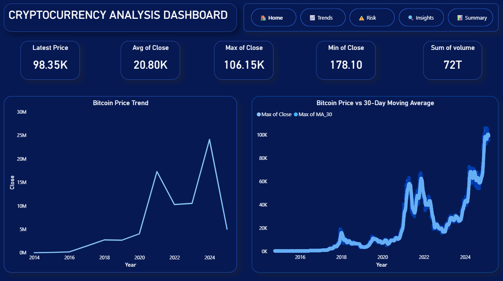
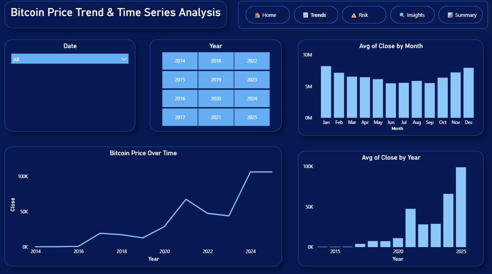
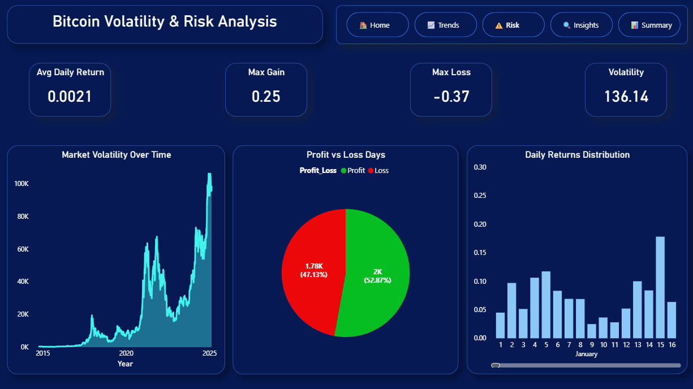
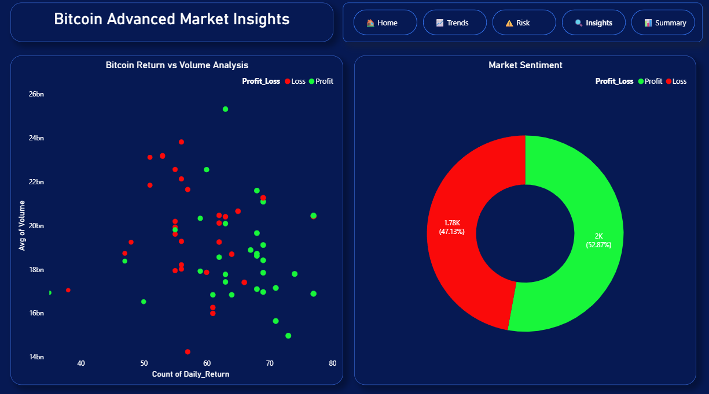
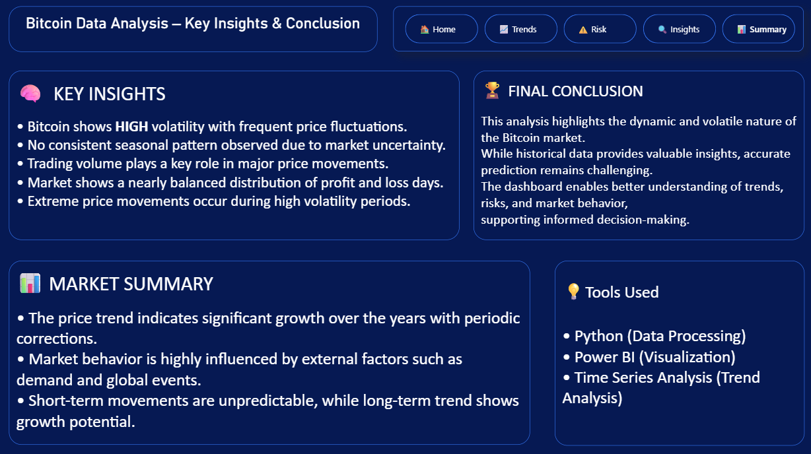

📊 Cryptocurrency Time Series Analysis

🚀 Project Overview
This project focuses on performing an in-depth time series analysis of cryptocurrency data, specifically Bitcoin, to uncover meaningful patterns, trends, and market behavior. The analysis leverages historical price and volume data to understand how the cryptocurrency market evolves over time.

The project also includes an interactive Power BI dashboard that visually represents key insights, enabling better interpretation and data-driven decision-making.

🎯 Objectives
The primary goals of this project are:

- To analyze historical Bitcoin price movements over time  
- To identify short-term and long-term trends in the cryptocurrency market  
- To study volatility and detect periods of high market fluctuation  
- To explore the relationship between trading volume and price changes  
- To present insights through an intuitive and interactive dashboard
  

🗂️ Dataset Description
The dataset used in this project contains historical Bitcoin data collected over a period of time.

📌 Key Features:
- **Date** – Timestamp of the recorded data  
- **Open Price** – Price at the beginning of the trading period  
- **High Price** – Highest price during the period  
- **Low Price** – Lowest price during the period  
- **Close Price** – Final price at the end of the period  
- **Volume** – Total trading volume  

The dataset was cleaned and preprocessed to ensure consistency and accuracy before analysis.

🛠️ Tools & Technologies Used
This project utilizes the following tools and technologies:

 🐍 **Python**
  - Pandas → Data manipulation and analysis  
  - NumPy → Numerical computations  

  📓 **Jupyter Notebook**
  - Used for exploratory data analysis (EDA) and time series processing  

  📊 **Power BI**
  - Built an interactive dashboard for visualization of key metrics  

  📁 **CSV Files**
  - Source of raw historical cryptocurrency data  

🔍 Data Analysis Process
The project follows a structured data analysis workflow:

1️⃣ Data Cleaning & Preprocessing
- Handled missing values and inconsistencies  
- Converted date columns into proper datetime format  
- Sorted data for accurate time series analysis  

2️⃣ Exploratory Data Analysis (EDA)
- Examined price distribution and trends  
- Analyzed variations in trading volume  
- Identified unusual spikes and drops  

3️⃣ Time Series Analysis
- Observed long-term upward and downward trends  
- Identified cyclical patterns in price movements  
- Studied volatility across different time periods  

4️⃣ Data Visualization
- Created interactive charts and KPIs in Power BI  
- Visualized trends, peaks, and dips clearly  
- Enabled user-driven filtering and exploration  

📈 Key Insights
The analysis revealed several important insights:

- 📌 Bitcoin shows **high volatility**, with frequent sharp price fluctuations  
- 📌 Significant **bull and bear cycles** are visible over time  
- 📌 Trading volume often increases during major price movements  
- 📌 Certain periods show **rapid growth followed by steep declines**  
- 📌 Long-term trend indicates overall growth despite short-term instability  

📊 Dashboard
The Power BI dashboard provides a visual summary of the analysis:

- Price trends over time  
- Volume analysis  
- Key performance indicators (KPIs)  
- Interactive filters for dynamic exploration  

👉 🔹 Dashboard Overview

  

  

  

  

  

🧠 Skills Demonstrated
This project highlights the following skills:

- Data Cleaning & Preprocessing  
- Exploratory Data Analysis (EDA)  
- Time Series Analysis  
- Data Visualization & Dashboarding  
- Analytical Thinking & Insight Generation  

## 📌 Conclusion
This project demonstrates how time series analysis techniques can be effectively applied to cryptocurrency data to extract valuable insights. It highlights the importance of understanding market behavior and using data visualization tools to communicate findings clearly.

The combination of Python for analysis and Power BI for visualization creates a powerful workflow for solving real-world data problems.

🙌 Acknowledgment
This project was developed as part of a hands-on data analytics learning journey to strengthen practical skills in data analysis, visualization, and storytelling.
